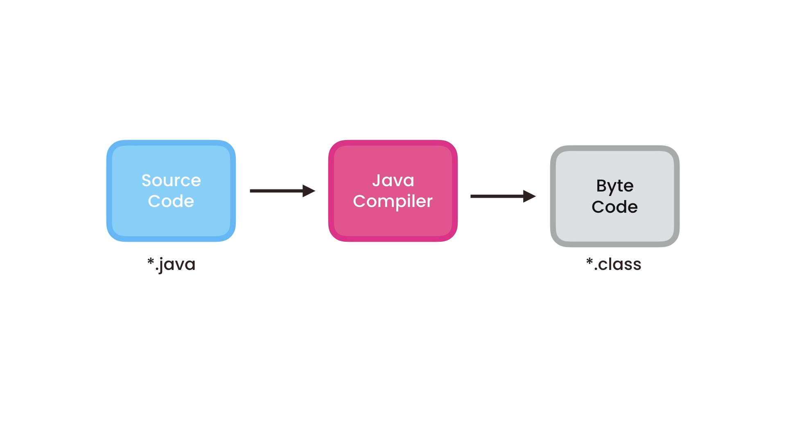
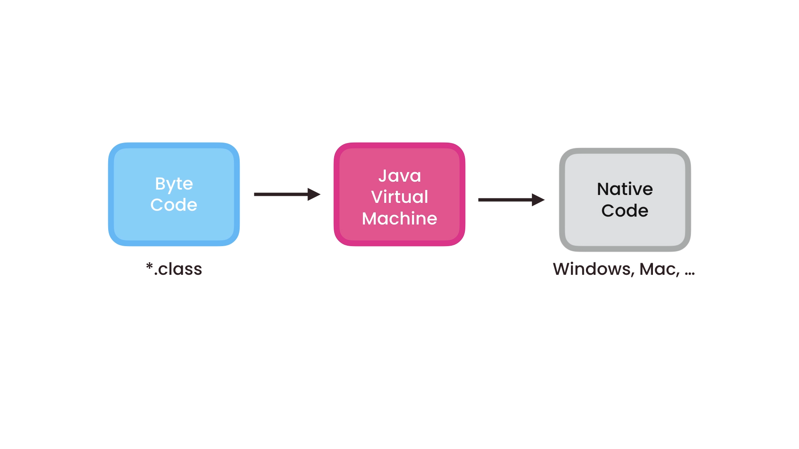
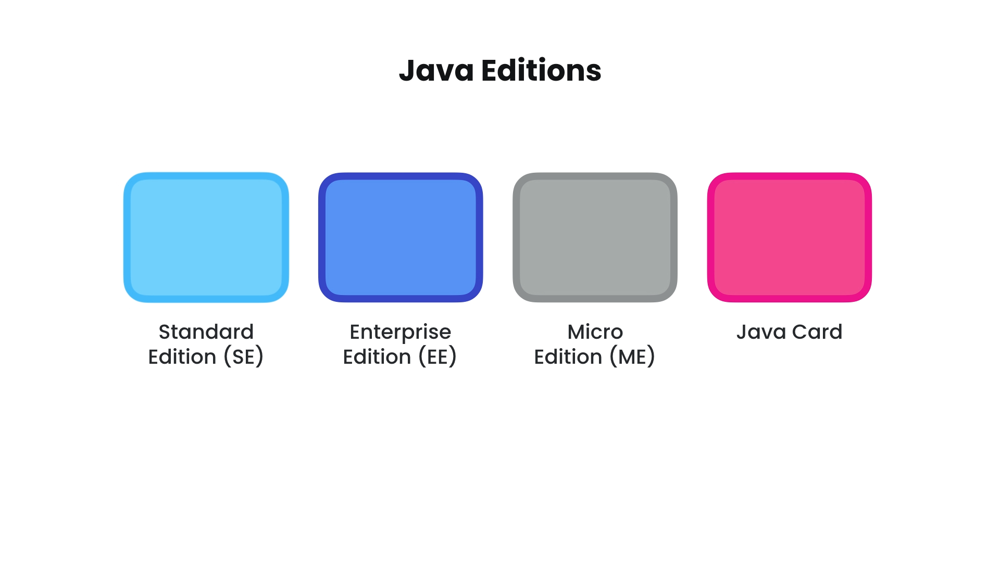
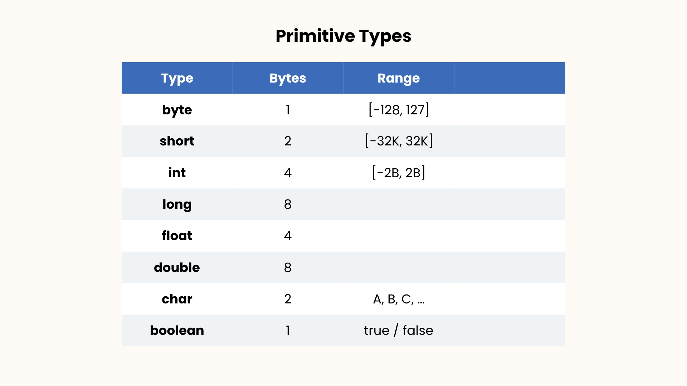
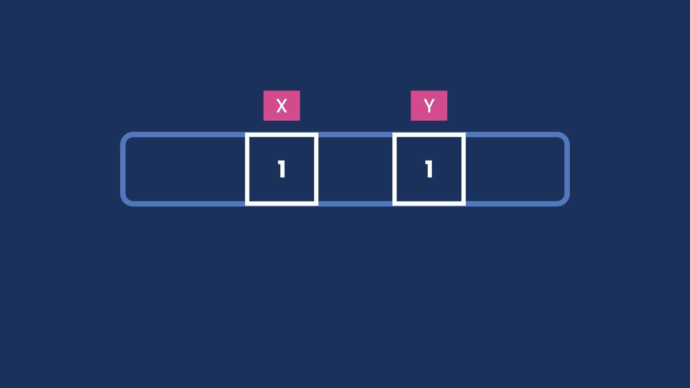
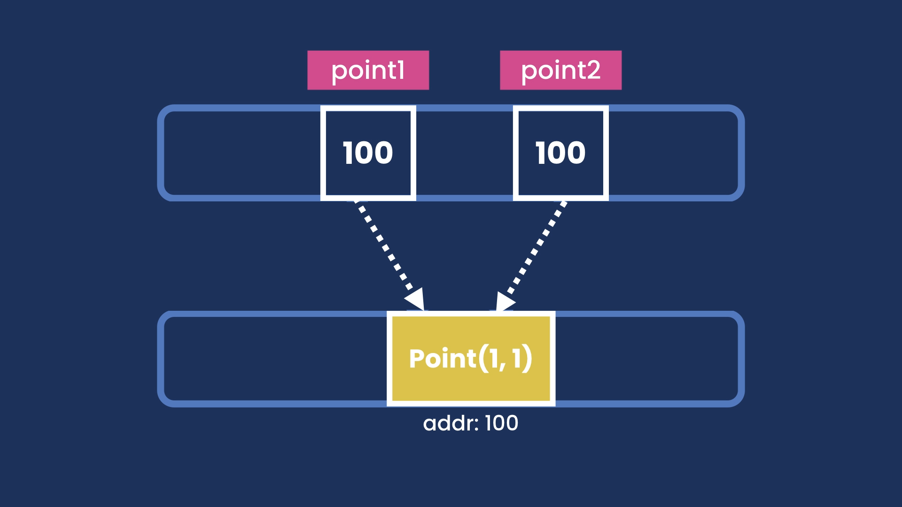
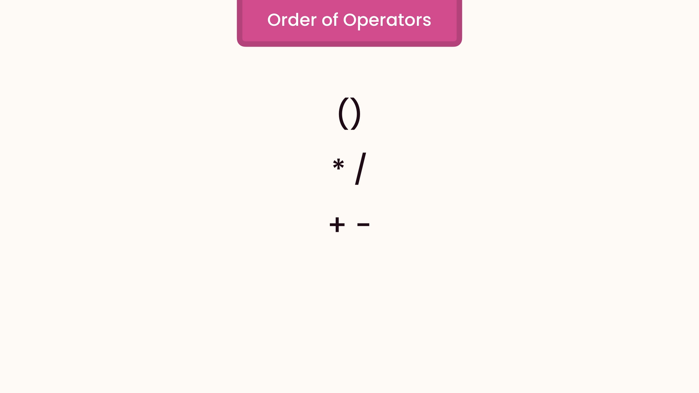

## Function:

- A block of code that performs a task.

```function
    void sendEmail(){
        ...
    }
```

- camelNamingConvention

## Class:

- A container for related functions.

```class
    public class Main {
        public void main() {
            ...
        }
    }
```

- PascalNamingConvention

## Compilation Process:



- **JRE**: Java Runtime Environment



```bash
    avinashbest/ $ javac Main.java
```

```bash
    avinashbest/ $ cd ..
```

```bash
    src/ $ java com.avinashbest.Main
```

## Interesting Facts about Java:

- Java was developed by James Gosling in 1995.



## Types:

- Primitive: for storing simple values, like numbers, characters, booleans
  

- How primitive types are stored in memory.

```bash
    public class Main {
        public static void main(String[] args) {
            int x = 1;
            int y = 1;
        }
    }
```



- Reference: for storing complex objects, like date, mail, message

- How primitive types are stored in memory.

```bash
    public class Main {
        public static void main(String[] args) {
            Point point1 = new Point(1, 1);
            Point point2 = point1;
        }
    }
```



## String:

```bash
    public class Main {
        public static void main(String[] args) {
            String message = "Hello World" + "!!";

            System.out.println(message.endsWith("!!"));
            System.out.println(message.startsWith("!!"));
            System.out.println(message.length());
            System.out.println(message.indexOf("l"));
            System.out.println(message.indexOf("sky"));
            System.out.println(message.replace("!", "*"));
            System.out.println(message.toLowerCase(Locale.ROOT));
            System.out.println(message.toUpperCase(Locale.ROOT));
            System.out.println(message.trim()) ; /*To remove unnecessary space.*/

            /*NOTE: IN JAVA, ALL THE METHOD WHICH PERFORM OPERATION ON STRING RETURNS A NEW STRING.*/
            /*ALL THE STRING IN JAVA ARE IMMUTABLE*/
            System.out.println(message);
        }
    }
```

## Escape Sequence:

```bash
    public class Main {

        public static void main(String[] args) {
            String message1 = "Hello \"Avinash\"";
            String message2 = "C:\\Windows\\...";
            String message3 = "C:\nWindows\n...";
            String message4 = "C:\tWindows\t...";

            System.out.println(message1);
            System.out.println(message2);
            System.out.println(message3);
            System.out.println(message4);
        }
    }
```

## Arrays:

```bash
    public class Main {
        public static void main(String[] args) {
            int[] number = {2, 4, 6, 8, 10};
            System.out.println(number.length);
            Arrays.sort(number);
            System.out.println(Arrays.toString(number));
        }
    }
```

## Multi-Dimensional Arrays:

```bash
    public class Main {

        public static void main(String[] args) {
            int[][] numbers = {{1, 2, 3}, {4, 5, 6}};
            System.out.println(Arrays.toString(numbers));
            System.out.println(Arrays.deepToString(numbers));
        }
    }
```

## Arithmetic Expressions:

```bash
    public class Main {
        public static void main(String[] args) {
            int result = 10 + 3;
            System.out.println(result);
            result = 10 - 3;
            System.out.println(result);
            result = 10 / 3;
            System.out.println(result);
            result = 10 * 3;
            System.out.println(result);
            result = 10 % 3;
            System.out.println(result);
        }
    }
```

## Increment / Decrement Operator:

```bash
    public class Main {
        public static void main(String[] args) {
            int x = 1;
            x++;
            System.out.println(x);
            ++x;
            System.out.println(x);

            x = 1;
            int y = x++; // post-increment
            System.out.println(x + "\t" + y);
            y = ++x; //pre-increment
            System.out.println(x + "\t" + y);

            x += 2; //x = x + 2
            System.out.println(x);
            x -= 2; //x = x - 2
            System.out.println(x);
            x *= 2; //x = x * 2
            System.out.println(x);
            x /= 2; //x = x / 2
            System.out.println(x);
            x %= 2; //x = x % 2
            System.out.println(x);
        }
    }
```

## Order of Operations:



```bash
    public class Main {
        public static void main(String[] args) {
            int x = (10 + 3) * 2;
        }
    }
```

## Type Casting:

```bash
    public class Main {
        public static void main(String[] args) {
            /*Implicit Casting*/
            /*byte > short > int > long > float > double*/
            short x = 1;
            int y = x + 2;
            System.out.println(y);
            /*Explicit Casting*/
            double a = 1.1;
            int b = (int) (a + 2);
            System.out.println(b);
            /*Parsing String in Integer*/
            String str = "123";
            System.out.println(Integer.parseInt(str));
        }
    }
```

## The Math Class:

```bash
    public class Main {
        public static void main(String[] args) {
            System.out.println(Math.round(1.2F));
            System.out.println(Math.round(1.2));
            System.out.println(Math.ceil(1.2));
            System.out.println(Math.floor(1.2));
            System.out.println(Math.max(200, 300));
            System.out.println(Math.min(200, 300));
            System.out.println(Math.random());//by default return a doubleType random number b/w 0 to 1
            System.out.println(Math.round(Math.random() * 100));
            System.out.println((int) (Math.random() * 100));
        }
    }
```

## Formatting Numbers:

```bash
    public class Main {
        public static void main(String[] args) {
            NumberFormat currency = NumberFormat.getCurrencyInstance();
            String result = currency.format(123456.789);
            System.out.println(result);

            NumberFormat percent = NumberFormat.getPercentInstance();
            String percentage = percent.format(0.1);
            System.out.println(percentage);

            System.out.println(NumberFormat.getCurrencyInstance().format(134343134313L));
        }
    }
```

## Reading Input:

```bash
    public class Main {
        public static void main(String[] args) {
            Scanner scanner = new Scanner(System.in);
            System.out.print("Age: ");
            byte age = scanner.nextByte();
            System.out.print("Name: ");
    //        String name = scanner.next(); //returns the next token
            String name = scanner.nextLine().trim(); //returns next line
            System.out.println("You are " + age);
            System.out.println("Your name " + name);
        }
    }
```

## Mortgage Calculator:

```bash
    public class Main {
        public static void main(String[] args) {
            final byte MONTHS_IN_YEAR = 12;
            final byte PERCENT = 100;

            Scanner scanner = new Scanner(System.in);

            System.out.print("Principal: ");
            int principal = scanner.nextInt();

            System.out.print("Annual Interest Rate: ");
            float annualInterest = scanner.nextFloat();
            float monthlyInterest = annualInterest / PERCENT / MONTHS_IN_YEAR;

            System.out.print("Period (Years): ");
            byte years = scanner.nextByte();
            int numberOfPayments = years * MONTHS_IN_YEAR;

            /*calculating mortgage*/
            double mortgage = principal * (monthlyInterest * Math.pow(1 + monthlyInterest, numberOfPayments) / (Math.pow(1 + monthlyInterest, numberOfPayments) - 1));

            System.out.println("Mortgage: " + NumberFormat.getCurrencyInstance().format(mortgage));
        }
    }
```

## Comparison Operators:

```bash
    public class Main {
        public static void main(String[] args) {
            int x = 1;
            int y = 1;
            System.out.println(x == y);
            System.out.println(x != y);
            System.out.println(x > y);
            System.out.println(x >= y);
            System.out.println(x < y);
            System.out.println(x <= y);
        }
    }
```

## Logical Operators:

```bash
    public class Main {
        public static void main(String[] args) {
            int temperature = 22;
            boolean isWarm = temperature > 20 && temperature < 30;
            System.out.println(isWarm);

            boolean hasHighIncome = true;
            boolean hasGoodCredit = true;
            boolean hasCriminalRecord = false;
            boolean isEligible = (hasGoodCredit || hasHighIncome) && !hasCriminalRecord;
            System.out.println(isEligible);
        }
    }
```

## if-statement:

```bash
    public class Main {
        public static void main(String[] args) {
            int temperature = 32;
            if (temperature > 32) {
                System.out.println("It's a hot day");
                System.out.println("Drink water");
            } else if (temperature > 20) {
                System.out.println("Beautiful day");
            } else {
                System.out.println("Cold day");
            }
            /*Simplifying if-statement*/
            int income = 120_000;
            boolean hasHighIncome;
            if (income > 100_000) {
                hasHighIncome = true;
            } else {
                hasHighIncome = false;
            }
            /*Above Expression can be simplified by professional be like*/
            int income = 120_000;
            boolean hasHighIncome = income > 100_000;
        }
    }
```

# Ternary Operators:

```bash
    public class Main {
        public static void main(String[] args) {
            int income = 120_000;
            String className;
            if (income > 100_000) {
                className = "First";
            } else {
                className = "Economy";
            }
            /*Simplification can be done as*/
            income = 120_000;
            className = "Economy";
            if (income > 100_000) {
                className = "First";
            }
            /*More Simplification can be done using Ternary Operator*/
            income = 120_000;
            className = (income > 100_000) ? "First" : "Economy";
        }
    }
```
