### Programming Paradigms:

- Procedural
- Functional
- Object-oriented
- Event-driven
- Logic
- Aspect-oriented

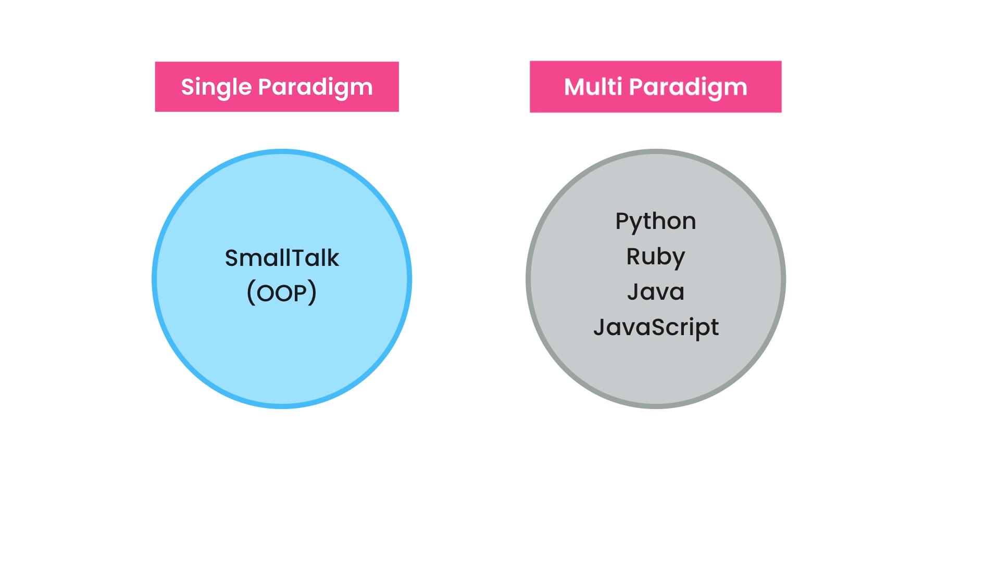

- Data (State)

- Methods (Behaviour)

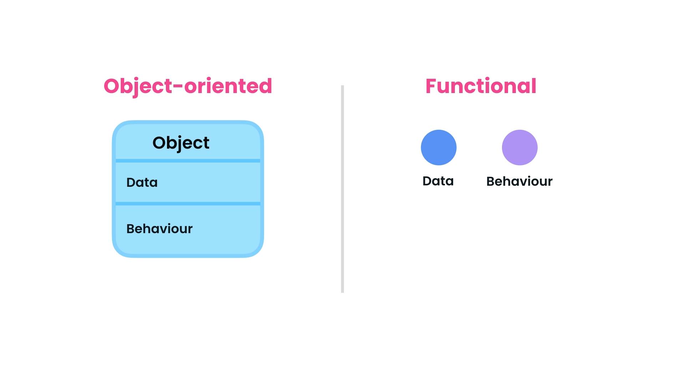

### Problem Solving:

Process of **defining a problem**, identifying and comparing **different solutions**, and picking the one that best solves that problem with respect to the **context** and **constraints**.

> Depends on the **problem**, **context** and **budget** we choose programming paradigms.

### Benefits:

- Reduced Complexity
- Easier Maintenance
- Code Reuse
- Faster Development

> Both object-oriented and functional programming are great.

### Classes:

A blueprint for creating objects.

### Objects:

An instance of a class.

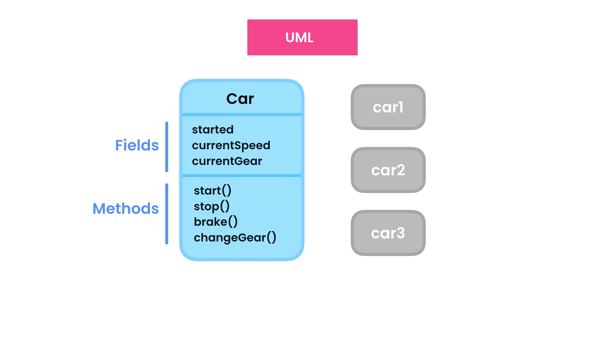
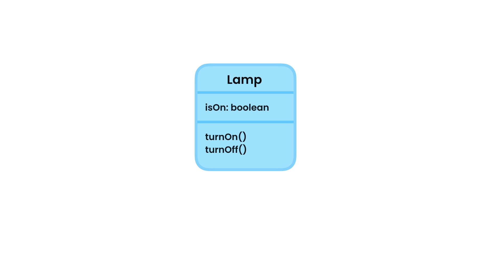
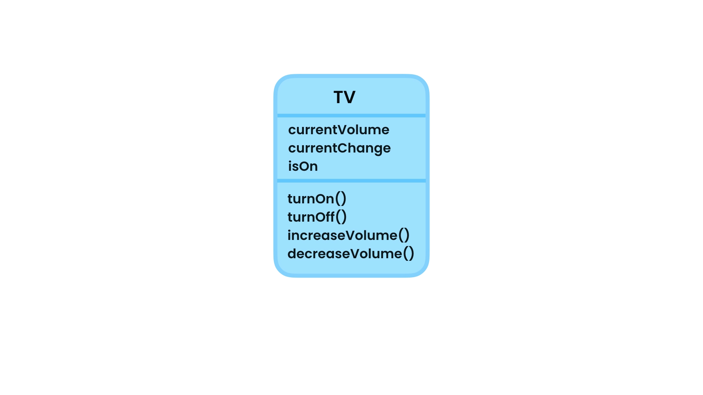
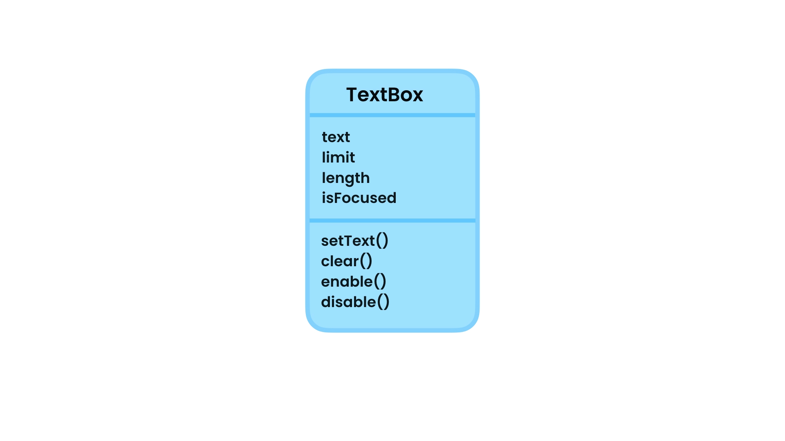

### Creating Classes:

```code
    public class TextBox {
        public String text;

        public void setText(String text) {
            this.text = text;
        }

        public void clear() {
            text = "";
        }
    }
```

### Memory Allocation:

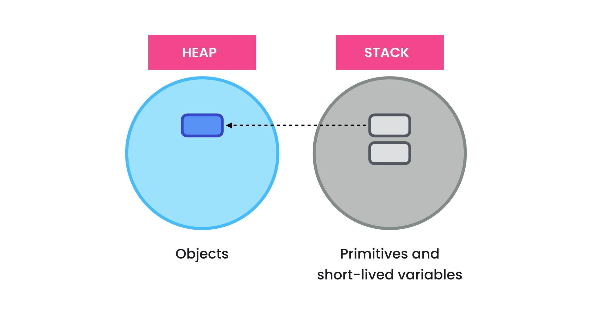

```code
    public class Main {
        public static void main(Strings[] args) {
            var textBox1 = new TextBox();
            var textBox2 = textBox1;
            textBox2.setText("Hello World");
            System.out.println(textBox1.text);
        }
    }
```

### Encapsulation:

Bundle the data and methods that operate on the data in a single unit.

```code
    public class Employee {
        public int baseSalary;
        public int hourlyRate;

        public int calculateWage(int extraHours) {
            return baseSalary + (extraHours * hourlyRate);
        }
    }
```

```code
    public class Main {
        public static void main(String[] args) {
            int baseSalary = 50_000;
            int extraHours = 10;
            int hourlyRate = 20;
            var employee = new Employee();
            employee.baseSalary = 50_000;
            employee.hourlyRate = 20;

            int wage = calculateWage(baseSalary, extraHours, hourlyRate);
            int wage = employee.calculateWage(10);
            System.out.println(wage);
        }

        public static int calculateWage(int baseSalary, int extraHours, int hourlyRate) {
            return baseSalary + (extraHours * hourlyRate);
        }
    }

```

### Abstraction:

Reduce complexity by hiding unnecessary details.

```code
    public class Employee {
        public int baseSalary;
        public int hourlyRate;
        private int baseSalary;
        private int hourlyRate;

        public int calculateWage(int extraHours) {
            return baseSalary + (extraHours * hourlyRate);
        }

        /*SETTERS*/
        public void setBaseSalary(int baseSalary) {
            if (baseSalary <= 0) {
                throw new IllegalArgumentException("Salary can't be 0 or less.");
            }
            this.baseSalary = baseSalary;
        }

        public void setHourlyRate(int hourlyRate) {
            if (hourlyRate <= 0) {
                throw new IllegalArgumentException("Hourly rate can't be 0 or less.");
            }
            this.hourlyRate = hourlyRate;
        }

        /*GETTERS*/
        public int getBaseSalary() {
            return this.baseSalary;
        }

        public int getHourlyRate() {
            return this.hourlyRate;
        }
    }
```

```code
    public class Main {
        public static void main(String[] args) {
            var employee = new Employee();
            employee.baseSalary = 50_000;
            employee.hourlyRate = 20;

            employee.setBaseSalary(50_000);
            System.out.println(employee.getBaseSalary());

            employee.setHourlyRate(100);
            System.out.println(employee.getHourlyRate());

            int wage = employee.calculateWage(10);
            System.out.println(wage);
        }
    }
```

### Coupling:

The level of dependency between classes.

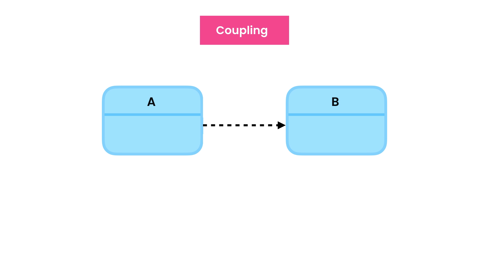
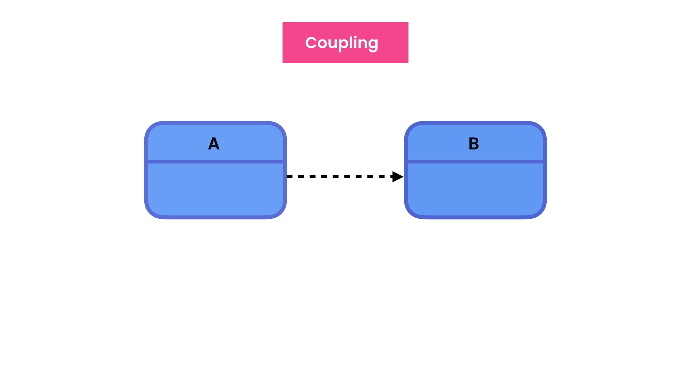
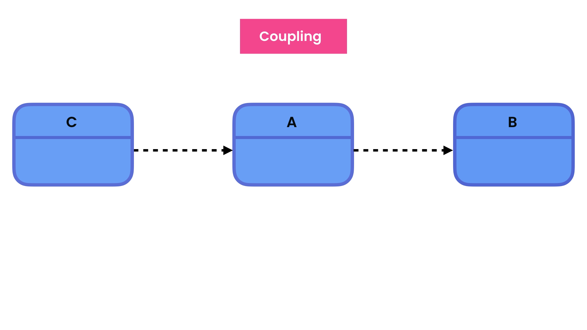
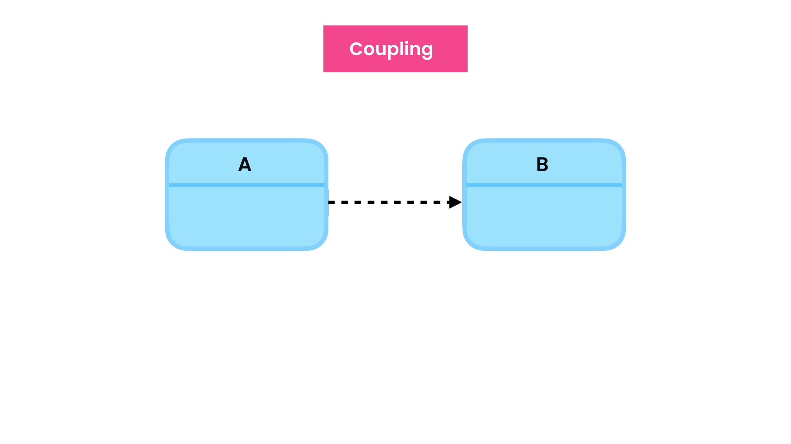
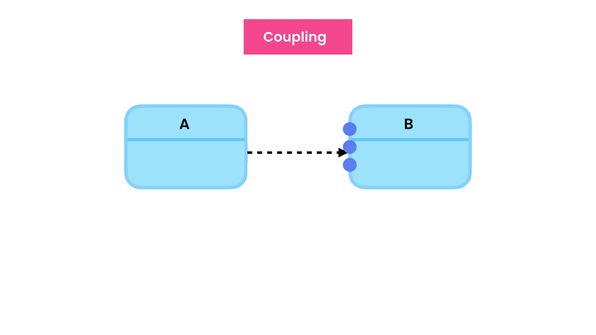

```code
    public class Employee {
        public int baseSalary;
        public int hourlyRate;
        private int baseSalary;
        private int hourlyRate;

        public int calculateWage(int extraHours) {
            return baseSalary + (extraHours * hourlyRate);
        }

        /*SETTERS*/
        public void setBaseSalary(int baseSalary) {
            if (baseSalary <= 0) {
                throw new IllegalArgumentException("Salary can't be 0 or less.");
            }
            this.baseSalary = baseSalary;
        }

        public void setHourlyRate(int hourlyRate) {
            if (hourlyRate <= 0) {
                throw new IllegalArgumentException("Hourly rate can't be 0 or less.");
            }
            this.hourlyRate = hourlyRate;
        }

        /*GETTERS*/
        private int getBaseSalary() {
            return this.baseSalary;
        }

        private int getHourlyRate() {
            return this.hourlyRate;
        }
    }
```

```code
    public class Main {
        public static void main(String[] args) {
            var employee = new Employee();
            employee.baseSalary = 50_000;
            employee.hourlyRate = 20;

            employee.setBaseSalary(50_000);
            employee.setHourlyRate(100);

            int wage = employee.calculateWage(10);
            System.out.println(wage);
        }
    }
```

### Reducing Coupling:

```code
    public class Browser {
        public void navigate(String address) {
            String ip = findIpAddress(address, true);
            String html = sendHttpRequest(ip);
            System.out.println(html);
        }

        /*In future if we change any of these method the main.class is not affected because these are implementation details.*/
        private String sendHttpRequest(String ip) {
            return "<html></html>";
        }

        private String findIpAddress(String address, boolean cache) {
            return "127.0.0.1";
        }
    }
```

```code
    public class Main {
        public static void main(String[] args) {
            var browser = new Browser();
            browser.navigate("https://www.google.com");
        }
    }
```

### Constructors:

```code
    public class Employee {
        public int baseSalary;
        public int hourlyRate;
        private int baseSalary;
        private int hourlyRate;

        /*CONSTRUCTORS*/
        public Employee(int baseSalary, int hourlyRate) {
            setBaseSalary(baseSalary);
            setHourlyRate(hourlyRate);
        }

        public int calculateWage(int extraHours) {
            return baseSalary + (extraHours * hourlyRate);
        }

        /*SETTERS*/
        private void setBaseSalary(int baseSalary) {
            if (baseSalary <= 0) {
                throw new IllegalArgumentException("Salary can't be 0 or less.");
            }
            this.baseSalary = baseSalary;
        }

        private void setHourlyRate(int hourlyRate) {
            if (hourlyRate <= 0) {
                throw new IllegalArgumentException("Hourly rate can't be 0 or less.");
            }
            this.hourlyRate = hourlyRate;
        }

        /*GETTERS*/
        private int getBaseSalary() {
            return this.baseSalary;
        }

        private int getHourlyRate() {
            return this.hourlyRate;
        }
    }
```

```code
    public class Main {
        public static void main(String[] args) {
            var employee = new Employee(50_000, 20);

            int wage = employee.calculateWage(10);
            System.out.println(wage);
        }
    }
```

### Method Overloading:

```code
    public class Employee {
        public int baseSalary;
        public int hourlyRate;
        private int baseSalary;
        private int hourlyRate;

        /*CONSTRUCTORS*/
        public Employee(int baseSalary, int hourlyRate) {
            setBaseSalary(baseSalary);
            setHourlyRate(hourlyRate);
        }

        public int calculateWage(int extraHours) {
            return baseSalary + (extraHours * hourlyRate);
        }

        /*METHOD OVERLOADING*/
        public int calculateWage() {
            return calculateWage(0);
        }


        /*SETTERS*/
        private void setBaseSalary(int baseSalary) {
            if (baseSalary <= 0) {
                throw new IllegalArgumentException("Salary can't be 0 or less.");
            }
            this.baseSalary = baseSalary;
        }

        private void setHourlyRate(int hourlyRate) {
            if (hourlyRate <= 0) {
                throw new IllegalArgumentException("Hourly rate can't be 0 or less.");
            }
            this.hourlyRate = hourlyRate;
        }

        /*GETTERS*/
        private int getBaseSalary() {
            return this.baseSalary;
        }

        private int getHourlyRate() {
            return this.hourlyRate;
        }
    }
```

```code
    public class Main {
        public static void main(String[] args) {
            var employee = new Employee(50_000, 20);

            int wage1 = employee.calculateWage(10);
            int wage2 = employee.calculateWage();

            System.out.println(wage1);
            System.out.println(wage2);
        }
    }
```

### Constructor Overloading:

```code
    public class Employee {
        public int baseSalary;
        public int hourlyRate;
        private int baseSalary;
        private int hourlyRate;

        /*CONSTRUCTORS*/
        public Employee(int baseSalary, int hourlyRate) {
            setBaseSalary(baseSalary);
            setHourlyRate(hourlyRate);
        }

        /*CONSTRUCTORS*/
        public Employee(int baseSalary) {
            this(baseSalary, 0);
        }

        public int calculateWage(int extraHours) {
            return baseSalary + (extraHours * hourlyRate);
        }

        /*METHOD OVERLOADING*/
        public int calculateWage() {
            return calculateWage(0);
        }


        /*SETTERS*/
        private void setBaseSalary(int baseSalary) {
            if (baseSalary <= 0) {
                throw new IllegalArgumentException("Salary can't be 0 or less.");
            }
            this.baseSalary = baseSalary;
        }

        private void setHourlyRate(int hourlyRate) {
            if (hourlyRate < 0) {
                throw new IllegalArgumentException("Hourly rate can't be 0 or less.");
            }
            this.hourlyRate = hourlyRate;
        }

        /*GETTERS*/
        private int getBaseSalary() {
            return this.baseSalary;
        }

        private int getHourlyRate() {
            return this.hourlyRate;
        }
    }
```

```code
    public class Main {
        public static void main(String[] args) {
            var employee1 = new Employee(50_000, 100);
            var employee2 = new Employee(50_000);

            int wage1 = employee1.calculateWage(10);
            int wage2 = employee2.calculateWage();

            System.out.println(wage1);
            System.out.println(wage2);
        }
    }
```

### Static Members:

```code
    public class Employee {
        public int baseSalary;
        public int hourlyRate;
        private int baseSalary;
        private int hourlyRate;

        /*Static fields belongs to class, they are independent of objects.*/
        public static int numberOfEmployees;

        /*CONSTRUCTORS*/
        public Employee(int baseSalary, int hourlyRate) {
            setBaseSalary(baseSalary);
            setHourlyRate(hourlyRate);
            numberOfEmployees++;
        }

        /*Static Methods belongs to class, they are independent of objects.*/
        public static void printNumberOfEmployee() {
            System.out.println("Number of Employee = " + numberOfEmployees);
        }

        /*CONSTRUCTORS*/
        public Employee(int baseSalary) {
            this(baseSalary, 0);
        }

        public int calculateWage(int extraHours) {
            return baseSalary + (extraHours * hourlyRate);
        }

        /*METHOD OVERLOADING*/
        public int calculateWage() {
            return calculateWage(0);
        }


        /*SETTERS*/
        private void setBaseSalary(int baseSalary) {
            if (baseSalary <= 0) {
                throw new IllegalArgumentException("Salary can't be 0 or less.");
            }
            this.baseSalary = baseSalary;
        }

        private void setHourlyRate(int hourlyRate) {
            if (hourlyRate < 0) {
                throw new IllegalArgumentException("Hourly rate can't be 0 or less.");
            }
            this.hourlyRate = hourlyRate;
        }

        /*GETTERS*/
        private int getBaseSalary() {
            return this.baseSalary;
        }

        private int getHourlyRate() {
            return this.hourlyRate;
        }
    }
```

```code
    public class Main {
        public static void main(String[] args) {
            var employee1 = new Employee(50_000, 100);
            Employee.printNumberOfEmployee();

            var employee2 = new Employee(50_000);
            Employee.printNumberOfEmployee();

            int wage1 = employee1.calculateWage(10);
            int wage2 = employee2.calculateWage();

            System.out.println(wage1);
            System.out.println(wage2);
            System.out.println("Wage of Employee = " + wage1);
            System.out.println("Wage of Employee = " + wage2);
        }
    }
```
